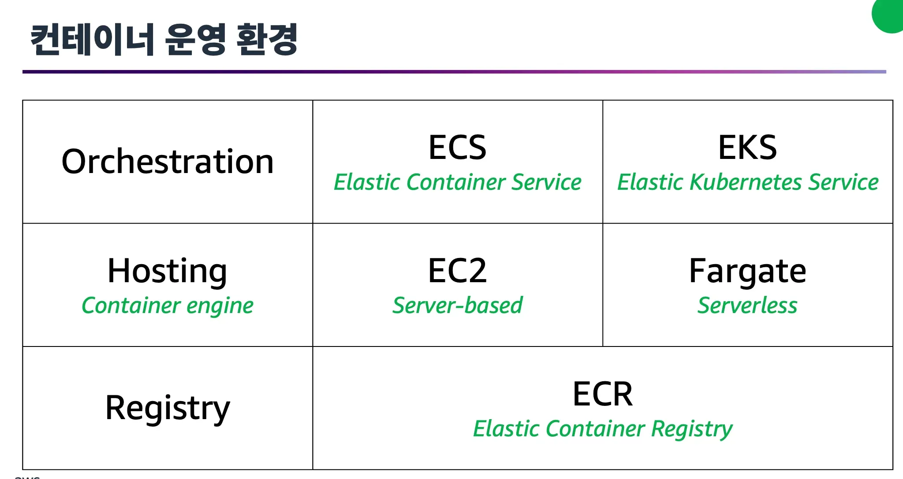

# Amazon EC2
## Amazon EC2
  - 안전하고 크기 조정이 가능한 컴퓨팅 용량 사용
  - 몇 분만에 서버 인스턴스 부팅
  - 사용한 만큼만 비용 지불
### 실행 과정
  - 몇 분 내에 EC2 인스턴스 프로비저닝 및 시작
  - 워크로드 실행을 마치면 사용 중지
  - 인스턴스가 실행중일 때 사용한 컴퓨터 시간에 대해서만 비용을 지불하고, 인스턴스가 중지 또는 종료되었을 때는 비용을 지불하지 않음
  - 필요한 서버 용량에 대해서만 비용 지불
### 작동 방식 요약
  **인스턴스 시작 -> 인스턴스에 연결 -> 인스턴스 사용**

## Amazon EC2 인스턴스 유형
|범용|컴퓨팅 최적화|메모리 최적화|가속 컴퓨팅|스토리지 최적화|
|---|---|---|---|---|
|컴퓨팅, 메모리, 네트워킹 리소스를 균형있게 제공|고성능 프로세서 제공|메모리 집약적 워크로드를 위한 빠른 성능 제공|하드웨어 엑셀러레이터를 사용하여 데이터 처리 가속화|낮은 지연 시간 및 높은 초당 입출력 작업 수 (IOPS) 제공|
|다양한 워크로드에 적합|컴퓨팅 집약적 애플리케이션 및 배치 처리 워크로드에 적합|고성능 데이터베이스에 적합|애플리케이션 스트리밍 및 그래픽 워크로드에 적합|분산 파일 시스템 및 데이터 웨어하우징 애플리케이션과 같은 워크로드에 적합|

## Amazon EC2 인스턴스 요금 옵션
|온디맨드|스팟|예약|Compute Saving Plans|전용 인스턴스|전용 호스트
|---|---|---|---|---|---|
|초기 선결제 비용이나 최소 약정 없음|시작 및 종료 시간이 자유로운 워크로드에 적합|온디맨드 요금에 비해 결제 할인 제공|컴퓨터 사용량이 일정할 경우 온디맨드에 비해 최대 66% 절감|단일 고객용 하드웨어의 VPC에서 실행되는 EC2 인스턴스|단일 고객용 EC2 인스턴스 용량을 갖춘 물리적 서버
|불규칙한 단기 워크로드에 적합|온디맨드 대비 비용 절감|1년 또는 3년 약정 필요(Old)|1년 또는 3년 약정 필요(New)|표준 Amazon EC2에 비해 더 높은 비용|가장 비용이 많이 드는 EC2 옵션   
* `Fleet`: 여러 인스턴스 사용
* `Tenancy`: Multi / Single -> 물리적인 환경의 공유 여부
* 전용 인스턴스와 전용 호스트의 차이: 반납 / 보존

## Amazon EC2 Auto Scaling
- 컴퓨팅 요구 사항의 변화에 따라 용량을 조정
- 동적 크기 조정 및 예측 크기 조정 사용
- Min / Desired Capacity / Max

## Elastic Load Balancing
- 여러 리소스에 자동으로 트래픽 분산 (Load Balancing)
- Auto Scaling 그룹에 단일 접점 제공 (Single Endpoint)
> 사용자 -> ELB -> EC2 인스턴스 1, EC2 인스턴스 2...

## AWS 메시징 서비스
### 애플리케이션 아키텍처
> 모놀리스 애플리케이션: 단일 서버에서 동작
> 마이크로서비스: 분산 서버에서 동작
### Amazon Simple Notification Service (SNS)
- 메시지가 주제에 게시됨 (Publising)
- 구독자는 자신의 주제에 대한 메시지를 즉시 수신 (Subscribing)
### Amazon Simple Queue Service (SQS)
- 소프트웨어 구성 요소 간에 메시지를 전송, **저장**, 수신
- 다른 서비스를 사용할 필요 없이 메시지를 대기열에 넣음
- 버퍼링, 비동기식

## 서버리스 컴퓨팅
- 코드가 서버에서 실행되지만 서버를 프로비저닝하거나 관리할 필요가 없음
- 서버리스 애플리케이션을 자동으로 확장하거나 처리량(throughput) 및 메모리와 같은 소비 단위를 수정하여 용량을 조정할 수 있는 유연성
- ex. AWS Lambda
### AWS Lambda
  - 서버를 프로비저닝하거나 관리할 필요 없이 코드 실행
  - 코드가 실행되는 컴퓨팅 시간에 대해서만 비용 지불
  - 다른 AWS 서비스를 사용하여 코드를 자동으로 트리거

## AWS 컨테이너 서비스 
  - 애플리케이션의 코드와 종속성을 하나의 객체로 패키징
  - 일관성 유지
### 컨테이너 오케스트레이션 서비스
- `ECS`: 컨테이너식 애플리케이션을 실행하고 확장할 수 있는 확장성이 뛰어난 고성능 컨테이너 관리 시스템. 간단한 API 호출을 사용하여 Docker 지원 애플리케이션 제어
- `EKS`: AWS에서 Kubernetes를 실행하는 데 사용할 수 있는 완전관리형 서비스. 새로운 기능으로 애플리케이션을 손쉽게 업데이트
### AWS Fargate
  - ECS 또는 EKS를 사용한 컨테이너용 서버리스 컴퓨팅 엔진
  - 사용한 리소스에 대해서만 비용 지불

