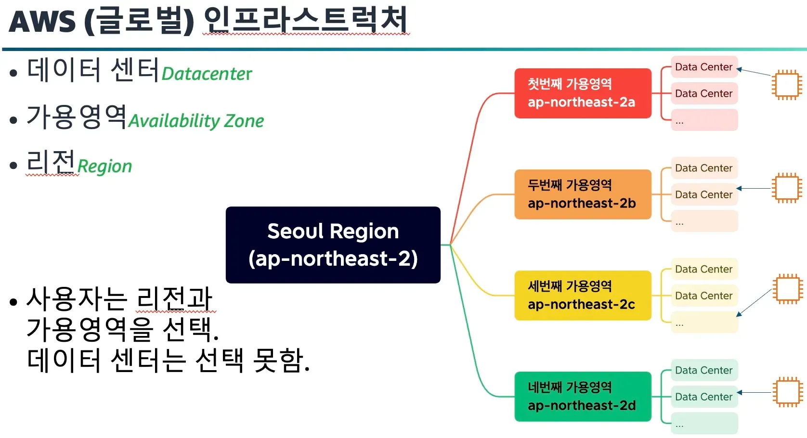
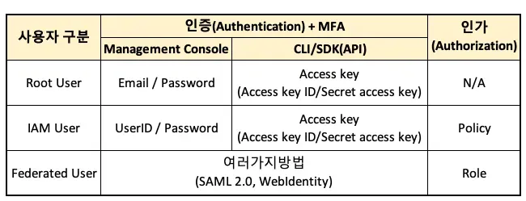

# AWS 글로벌 인프라 및 AWS 서비스와 상호 작용 방법
## AWS 글로벌 인프라 살펴보기

### 리전 선택
다음을 기반으로 서비스, 데이터 및 애플리케이션에 적합한 리전 결정
- 데이터 거버넌스 및 법적 요구 사항 준수
- 고객과의 근접성
- 요금
- 리전 내에서 사용 가능한 서비스

### 가용 영역
리전 내의 단일 데이터 센터 또는 데이터 센터 그룹

## 고객에게 더 가까이
### Amazon CloudFront에서 콘텐츠 전송
- 엣지 로케이션은 CloudFront가 고객에게 더 빨리 콘텐츠를 전송하기 위해 캐시된 콘텐츠 사본을 저장하는 데 사용하는 사이트
(* CDN: Content Delivery Network)
## AWS Outposts
- 온프레미스 위치 내에서 하이브리드 방식으로 AWS 인프라, 서비스, 도구를 실행하는데 사용할 수 있는 서비스
- 데이터 집약적이거나 시간에 민감한 요구사항이 있는 워크로드 지원
- Outposts가 온프레미스 위치에 설치되면 가장 가까운 AWS 리전에 연결됨. 계속 AWS 서비스에 엑세스하고 모니터링 및 관리할 수 있음

## AWS 서비스와 상호 작용
### API 요청을 통해 작업 수행
- AWS 관리 콘솔, AWS CLI, 소프트웨어 개발 키트 (SDK) 세 가지 방법으로 액세스와 상호 작용
