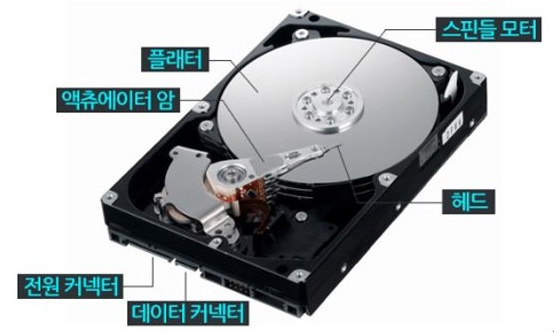
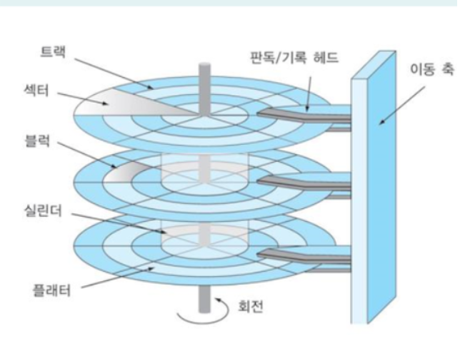

# 4.1 디스크 기본 구조
## 물리적 구조


- 디스크의 저장 영역은 하나 또는 그 이상의 플래터로 구성됨
- 플래터는 회전함
- 엑세스 암은 단일 단위에 읽기/쓰기 헤더를 이용하여 신속하게 수행
- 읽기/쓰기 헤더는 플래터 양옆의 마그네틱 표면에 데이터에 대한 읽기, 쓰기를 수행

|부분|내용|
|---|---|
| 플래터 (Platter)| 실제 데이터가 저장되는 위치. 자기장을 이용하여 기록됨. 디스크에는 한 개 이상의 플래터가 존재하고, 각 플래터의 양면에 기록 가능|
| 스핀들 (Spindle) | 플래터를 회전 시키는 역할. 디스크 사용에서 RPM은 스핀들 모터의 회전속도를 의미함|
| 헤드 (Head) | 플래터에 데이터를 기록하는 기능. 디스크와 매우 가깝게 붙어있어서 디스크에 충격이 가해질 경우 헤드가 플래터를 손상시킬 수 있음. 각 플래터의 양면에 각각 1개씩 위치|
| 액추에이터 (Actuator) | 디스크 제어 컨트롤러에 의해 디스크 플래터의 원하는 위치에 있는 데이터를 읽어오기 위해 암을 이동시키는 역할 |
| 액추에이터 암 (Actuator Arm) | 액추에이터에 의하여 움직여지고, 각 암마다 한 개씩의 헤드가 붙어있음. (= 액세스 암) |
| 커넥터 (Connector)| 디스크의 연결 인터페이스 종류에 맞는 케이블 연결을 담당. 일반적으로 IDE, S-ATA, SCSI 등을 사용 |
| 점퍼 블록 (Jumper Block)| IDE 인터페이스를 사용하는 하드 디스크의 경우 Master/Slave를 결정하기 위한 점퍼를 설정하여야 함. 다른 인터페이스의 경우에는 점퍼가 필요하지 않음 |
| 전원 커넥터 (Power Connector)| 디스크 구동에 필요한 전원 케이블 연결 |

## 논리적 구조
- 디스크(Disk) > 파티션(Partition) > 실린더(Cylinder) > 트랙(Track) > 섹터(Sector)


| 부분 | 내용|
|---|---|
| 섹터 | 플래터의 가장 작은 단위. 1개 섹터는 512 byte. |
| 트랙 | 섹터가 모여 하나의 원을 구성. 트랙은 많은 수의 섹터를 가지고 있으며, 플래터 내에 여러 개의 트랙이 존재. 가장 바깥쪽의 트랙은 가장 안쪽의 트랙보다 더 많은 섹터를 가짐 |
| 실린더 | 여러 동심 트랙에 대한 스택 구조 |


## 디스크 파티션 (Disk Partition)
- 하나의 디스크를 여러 개의 디스크가 있는 것처럼 나누어 사용
- 각 파티션은 개별적으로 관리됨

### MBR 파티션 (Master Boot Record)
  - 최대 4개까지의 파티션을 지원
  - 2TB까지 지원
### GPT 파티션 (GUID Partition Table)
  - 최대 128개의 파티션을 지원
  - 9.2ZB까지 지원
  - 상대적 최신 방식

## 디스크 이름 및 확인
### 디스크 연결 인터페이스 방식
- E-DIE 방식 (Enhanced - Integrated Drive Electronics)
- <span style="background-color:lightsalmon">SATA (Serial ATA) 방식</span>
- <span style="background-color:lightsalmon">SCSI (Small Computer System Interface)</span>
- SA-SCSI (Serial Attached SCSI:SAS)

## 리눅스 시스템 스토리지 장치명
- 리눅스 시스템의 하드웨어 장치는 `/dev` 디렉터리 내에 파일로 생성됨. 디스크 연결 후 생성된 장치 파일명을 사용하여 파티셔닝 작업 수행
- 디스크 인터페이스 방식에 따라 장치명이 달라짐
> 인터페이스별 장치명 + 장치 번호 + [파티션번호(숫자)]
- E-IDE 인터페이스: hd 장치명, 현재는 거의 사용되지 않음
- **SATA/SCSI/SA-SCSI 방식**: 모두 sd 장치명 사용
- CD-ROM / DVD-ROM 등의 ODD (Optical Disk Drive)

# 4.2 하드디스크 파티셔닝
```
[vagrant@user03 ~]$ lsblk # 디스크 또는 파티션 정보 확인
NAME   MAJ:MIN RM  SIZE RO TYPE MOUNTPOINTS
sda      8:0    0   50G  0 disk 
├─sda1   8:1    0  600M  0 part /boot/efi
├─sda2   8:2    0    1G  0 part /boot
└─sda3   8:3    0 48.4G  0 part / # 현재는 sda만 있음
```

## fdisk
- x86 시스템의 MBR 파티셔닝을 위하여 오랫동안 사용해온 도구
- 명령 실행 시 파티션을 구성할 디스크를 명령의 인자로 입력해야 함

### 접속 및 파티션 생성
```
[vagrant@user03 ~]$ sudo fdisk /dev/sdb # 접속

Welcome to fdisk (util-linux 2.37.4).
Changes will remain in memory only, until you decide to write them.
Be careful before using the write command.

Device does not contain a recognized partition table.
Created a new DOS disklabel with disk identifier 0x9d5740ef.

Command (m for help): n # 새 파티션 추가
Partition type
   p   primary (0 primary, 0 extended, 4 free) # MBR 방식
   e   extended (container for logical partitions)
Select (default p):

Using default response p.
Partition number (1-4, default 1):
First sector (2048-41943039, default 2048):
Last sector, +/-sectors or +/-size{K,M,G,T,P} (2048-41943039, default 41943039): +2G # 용량 2GB

Created a new partition 1 of type 'Linux' and of size 2 GiB.
```
### 파티션 확인
```
Command (m for help): p # 파티션 확인
Disk /dev/sdb: 20 GiB, 21474836480 bytes, 41943040 sectors 
Disk model: HARDDISK
Units: sectors of 1 * 512 = 512 bytes
Sector size (logical/physical): 512 bytes / 512 bytes
I/O size (minimum/optimal): 512 bytes / 512 bytes
Disklabel type: dos
Disk identifier: 0x9d5740ef

Device     Boot Start     End Sectors Size Id Type
/dev/sdb1        2048 4196351 4194304   2G 83 Linux # sdb 디스크에서 첫 번째 디스크 생성
```
### 두 번째 디스크 생성
```
Command (m for help): n
Partition type
   p   primary (1 primary, 0 extended, 3 free)
   e   extended (container for logical partitions)
Select (default p): p
Partition number (2-4, default 2): 2
First sector (4196352-41943039, default 4196352):
Last sector, +/-sectors or +/-size{K,M,G,T,P} (4196352-41943039, default 41943039): +3G

Created a new partition 2 of type 'Linux' and of size 3 GiB.

Command (m for help): p # 파티션 확인
Disk /dev/sdb: 20 GiB, 21474836480 bytes, 41943040 sectors
Disk model: HARDDISK
Units: sectors of 1 * 512 = 512 bytes
Sector size (logical/physical): 512 bytes / 512 bytes
I/O size (minimum/optimal): 512 bytes / 512 bytes
Disklabel type: dos
Disk identifier: 0x9d5740ef

Device     Boot   Start      End Sectors Size Id Type
/dev/sdb1          2048  4196351 4194304   2G 83 Linux
/dev/sdb2       4196352 10487807 6291456   3G 83 Linux # 두 번째 파티션 추가 완료
```
### 타입 변경
```
Command (m for help): t
Partition number (1,2, default 2): 1

Hex code or alias (type L to list all): L

00 Empty            24 NEC DOS          81 Minix / old Lin  bf Solaris
01 FAT12            27 Hidden NTFS Win  82 Linux swap / So  c1 DRDOS/sec (FAT-
02 XENIX root       39 Plan 9           83 Linux            c4 DRDOS/sec (FAT-
...

Aliases:
   linux          - 83
   swap           - 82
   ...

Hex code or alias (type L to list all): 82
Changed type of partition 'Linux' to 'Linux swap / Solaris'. # 타입 변경
```
### 파티션 삭제
```
Command (m for help): d # 파티션 삭제
Partition number (1,2, default 2): 2

Partition 2 has been deleted.
```
- 부모 파티션을 지우면 하위 파티션도 모두 삭제됨
### 저장 후 종료
```
Command (m for help): w # 파티션 정보를 디스크에 저장 후 종료
The partition table has been altered.
Calling ioctl() to re-read partition table.
Syncing disks.

[vagrant@user03 ~]$ lsblk
NAME   MAJ:MIN RM  SIZE RO TYPE MOUNTPOINTS
sda      8:0    0   50G  0 disk
├─sda1   8:1    0  600M  0 part /boot/efi
├─sda2   8:2    0    1G  0 part /boot
└─sda3   8:3    0 48.4G  0 part /
sdb      8:16   0   20G  0 disk 
└─sdb1   8:17   0    2G  0 part # 파티셔닝 성공 확인
```

### 확장 파티션 생성
```
Command (m for help): n
Partition type
   p   primary (1 primary, 0 extended, 3 free)
   e   extended (container for logical partitions)
Select (default p): e
Partition number (2-4, default 2): 
First sector (4196352-41943039, default 4196352): 
Last sector, +/-sectors or +/-size{K,M,G,T,P} (4196352-41943039, default 41943039):

# 남은 용량 모두를 확장 파티션으로 만듦
Created a new partition 2 of type 'Extended' and of size 18 GiB. 

Command (m for help): p
Disk /dev/sdb: 20 GiB, 21474836480 bytes, 41943040 sectors
Disk model: HARDDISK
Units: sectors of 1 * 512 = 512 bytes
Sector size (logical/physical): 512 bytes / 512 bytes
I/O size (minimum/optimal): 512 bytes / 512 bytes
Disklabel type: dos
Disk identifier: 0x9d5740ef

Device     Boot   Start      End  Sectors Size Id Type
/dev/sdb1          2048  4196351  4194304   2G 82 Linux swap / Solaris
/dev/sdb2       4196352 41943039 37746688  18G  5 Extended # 타입이 확장 파티션이 됨
```
### 논리 파티션 생성
```
Command (m for help): n
All space for primary partitions is in use.
Adding logical partition 5
First sector (4198400-41943039, default 4198400):
Last sector, +/-sectors or +/-size{K,M,G,T,P} (4198400-41943039, default 41943039): +3G

Created a new partition 5 of type 'Linux' and of size 3 GiB.

Command (m for help): p
Disk /dev/sdb: 20 GiB, 21474836480 bytes, 41943040 sectors
Disk model: HARDDISK
Units: sectors of 1 * 512 = 512 bytes
Sector size (logical/physical): 512 bytes / 512 bytes
I/O size (minimum/optimal): 512 bytes / 512 bytes
Disklabel type: dos
Disk identifier: 0x9d5740ef

Device     Boot   Start      End  Sectors Size Id Type
/dev/sdb1          2048  4196351  4194304   2G 82 Linux swap / Solaris
/dev/sdb2       4196352 41943039 37746688  18G  5 Extended
/dev/sdb5       4198400 10489855  6291456   3G 83 Linux # 논리 파티션 생성
```

## partprobe
- 기본적으로는 전체 연결된 디스크들에 대한 파티션 정보를 재인식
- 시스템 리소스를 많이 사용하기 때문에 파티션을 지정하는 것이 좋음
```
partprobe /dev/sdb
```