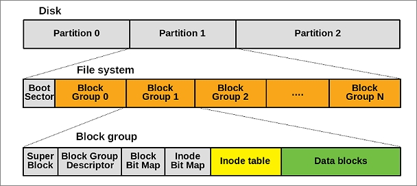

# 5.1 리눅스 파일시스템 소개
> 구조화된 일련의 정보를 구성하는 파일과 디렉터리의 집합, 파일 및 디렉터리를 저장하는 방식
## 리눅스 파일 시스템 소개
### 디스크 기반 파일 시스템 (Disk-Based File System)
: 하드디스크, CD-ROM, DVD 등을 기반으로 하는 파일 시스템
- `EXT`: 리눅스 초기 개발 시 리눅스에서 사용하기 위하여 만들어진 확장 파일 시스템
- `XFS`: SGI 사에 의해서 개발된 파일 시스템으로, 기존 IRIX 시스템에서 사용되던 파일 시스템이 리눅스로 이식. 대부분의 리눅스에서 지원되며, RHEL7, CentOS7, OL7 등 최신 리눅스 버전에서 기본 파일 시스템으로 사용됨
> RHEL7 까지는 init, 최신 시스템은 systemd
- `FAT`: Microsoft DOS 및 초기 윈도우 용으로 개발된 파일 시스템. 현재는 USB 등에 주로 사용되며, 리눅스에서는 FAT와 vFAT 지원

### 분산 파일 시스템 (Distributed File System)
네트워크를 통해 파일 시스템의 자원에 접근할 수 있도록 지원하는 파일 시스템
- `NFS (Network File System)`: Oracle에서 개발된 네트워크 기반 분산 파일 시스템. 대부분의 유닉스/리눅스에서 사용할 수 있는 분산 파일 시스템 방식이며 공유된 자원을 로컬 시스템의 자원처럼 사용할 수 있음
- `SMB (Server Message Block)`: Microsoft의 LM(Lan Manager) 및 NetBIOS 기반의 파일 및 장치 공유 프로토콜인 'SMB' 기반의 분산 파일 시스템. 윈도우 <-> 유닉스/리눅스 간 디렉터리 및 파일 공유 기능을 제공. 리눅스에서는 삼바(Samba) 서비스를 통해 SMB 공유를 제공할 수 있음

### Pseudo 파일 시스템
가상 메모리 기반의 파일 시스템으로 시스템 성능을 높이고 커널 정보에 접근할 수 있도록 지운. 메모리 기반 파일 시스템은 대부분 시스템에 의하여 자동으로 생성되거나 해제됨. 
=> 사용 중인 메모리 기반 파일 시스템을 사용자가 임의로 해제할 경우 시스템에 문제가 발생할 수 있으므로 주의 
- `swqpfs`: 스왑 파일 시스템(Swap File System)은 물리 메모리를 보조하기 위한 디스크 내의 스왑영역에서 사용하는 파일 시스템

## 주요 파일 시스템 구조
### ext4 파일 시스템
#### 주요 특징
- 파일 시스템 전체에 대한 주요 정보는 슈퍼 블록(Super Block)에 저장
- ext4 파일 시스템 내에 여러 개의 블록 그룹(Block Group)이 존재
- 슈퍼 블록의 백업이 일부 블록 그룹에 저장
- inode를 사용하여 파일의 메타정보와 데이터를 분리하여 저장


#### 구조
- `패딩`
- `ext4 슈퍼 블록`
- `그룹 디스크립터`
- `데이터 블록 / inode 비트맵`
- `inode 테이블`
- `데이터 블록`

### xfs 파일 시스템
RHEL 7 등의 최신 버전 리눅스의 기본 파일 시스템으로 사용됨

# 5.2 파일 시스템 관리
## 파일 시스템 생성
> 디스크 파티셔닝이 완료되면, 파티셔닝된 장치에 파일 시스템을 생성해야 파일 및 디렉터리 저장 가능
```
mkfs -t [filesystem-type] partition
```
- `-t` 옵션은 파일 시스템의 종류를 지정 (빈 값일 경우 ext2로 자동 지정)
### xfs 포맷 적용
```
[vagrant@user03 ~]$ sudo mkfs.xfs /dev/sdb1
meta-data=/dev/sdb1              isize=512    agcount=4, agsize=131072 blks
         =                       sectsz=512   attr=2, projid32bit=1
         =                       crc=1        finobt=1, sparse=1, rmapbt=0
         =                       reflink=1    bigtime=1 inobtcount=1 nrext64=0
data     =                       bsize=4096   blocks=524288, imaxpct=25
         =                       sunit=0      swidth=0 blks
naming   =version 2              bsize=4096   ascii-ci=0, ftype=1
log      =internal log           bsize=4096   blocks=16384, version=2
         =                       sectsz=512   sunit=0 blks, lazy-count=1
realtime =none                   extsz=4096   blocks=0, rtextents=0
[vagrant@user03 ~]$ file /dev/sdb1
/dev/sdb1: block special (8/17)
[vagrant@user03 ~]$ sudo file -s /dev/sdb1
/dev/sdb1: SGI XFS filesystem data (blksz 4096, inosz 512, v2 dirs)
```

```
[vagrant@user03 ~]$ sudo file -s /dev/sdb2 
/dev/sdb2: Linux swap file, 4k page size, little endian, version 1, size 786431 pages, 0 bad pages, no label, UUID=00da60a9-42e6-4414-b9b8-dc6709bf7d65

[vagrant@user03 ~]$ sudo blkid # 장치 이름 대신 UUID를 쓸 수 있음
/dev/sdb2: UUID="00da60a9-42e6-4414-b9b8-dc6709bf7d65" TYPE="swap" PTTYPE="dos" PARTUUID="9d5740ef-02"
...
```

## 파일 시스템 마운트
파일 시스템을 생성한 후에는 파일 시스템에 접근할 수 있는 경로를 생성해야 하는데, 이 과정을 `마운트(mount)`라고 함
### mount 명령을 사용하여 파일 시스템 마운트
```
[vagrant@user03 ~]$ sudo mkdir /mnt/xfsdata
[vagrant@user03 ~]$ sudo mount /dev/sdb1 /mnt/xfsdata/
mount: (hint) your fstab has been modified, but systemd still uses
       the old version; use 'systemctl daemon-reload' to reload.
[vagrant@user03 ~]$ df -h
Filesystem      Size  Used Avail Use% Mounted on
devtmpfs        4.0M     0  4.0M   0% /dev
tmpfs           471M     0  471M   0% /dev/shm
tmpfs           189M  5.4M  183M   3% /run
efivarfs        256K   14K  238K   6% /sys/firmware/efi/efivars
/dev/sda3        49G  1.6G   47G   4% /
/dev/sda2       960M   97M  864M  11% /boot
/dev/sda1       599M  7.1M  592M   2% /boot/efi
tmpfs            95M     0   95M   0% /run/user/1000
/dev/sdb1       2.0G   47M  1.9G   3% /mnt/xfsdata

[vagrant@user03 ~]$ mount | grep sdb1 # 마운트 성공 여부 확인
/dev/sdb1 on /mnt/xfsdata type xfs (rw,relatime,seclabel,attr2,inode64,logbufs=8,logbsize=32k,noquota)
[vagrant@user03 ~]$ sudo touch /mnt/xfsdata/testfile # 연결한 파티션에 파일 생성 
[vagrant@user03 ~]$ ls /mnt/xfsdata/ # 파일 존재 여부 확인
testfile
```
### 파일 시스템 테이블 (File System Table)에 등록하여 마운트 (영구 마운트)
```
[vagrant@user03 ~]$ sudo vi /etc/fstab # 파일 시스템에 대한 마운트 정보를 등록해야 하는 파일

/dev/sdb1       /mnt/xfsdata    xfs     defaults        0 0 # 추가 후 저장

[vagrant@user03 ~]$ df -h | grep sdb #마운트 결과 확인
/dev/sdb1       2.0G   47M  1.9G   3% /mnt/xfsdata
```

### 파일 마운트 해제
```
[vagrant@user03 ~]$ sudo umount /dev/sdb1
```

# 5.3 스왑 메모리
> RAM의 용량 확장의 제약 때문에 물리 메모리와 스왑 영역을 합산하여 가상 메모리로 사용
## 페이징 (Paging)
- 스왑 영역을 물리 메모리처럼 사용할 수 있다고 해서, CPU가 스왑 영역에 있는 데이터를 물리 메모리처럼 직접 접근하여 읽을 수 있는 것은 아님. CPU가 데이터를 접근하기 위해서는 프로세스가 반드시 물리 메모리 영역에 존재해야 하고, 이 때 만약 프로세스가 스왑 영역에 존재한다면, 스왑 영역의 데이터를 물리 메모리 영역으로 이동시키는 작업이 필요한데, 이 작업을 `페이지 인(Page-in)`이라고 함
- 반대로, 물리 메모리에 위치한 프로세스의 우선 순위가 낮거나 당분간 사용하지 않을 경우, 다른 프로세스를 위해 물리 메모리를 스왑 영역으로 이동시키는 작업도 필요한데, 이 작업을 `페이지 아웃(Page-out)`이라고 함
- 페이지 인과 페이지 아웃을 통틀어 페이징이라고 함
       -> 페이징은 디스크 IO를 많이 발생시켜서 성능을 저하시키므로, 디스크 ID가 많은 시스템의 경우에는 스왑 영역을 최소한으로 두어야 하며, 디스크 IO는 적으나 실행할 프로세스가 많은 시스템의 경우는 스왑 영역을 물리 메모리의 2배 이상으로 설정 

## 스왑 영역 구성
> 현재 시스템에 구성된 스왑을 확인하기 위하여 swapon 명령과 free 명령을 사용
- `swapon`: 스왑 영역의 활성화와 스왑 영역 확인. `-s` 옵션을 함께 사용하면 활성화된 스왑 영역의 목록, 유형, 사이즈, 사용량, 우선순위가 출력
- `free`: 전체 물리메모리의 사이즈 및 사용량, 스왑 영역의 사용량 등을 출력. `-h` 옵션을 추가하여 실행하면 사이즈가 사용자가 읽기 쉬운 단위로 출력됨

### 스왑 활성화 / 비활성화
> 스왑 영역이 생성된 뒤에는 시스템에서 스왑 영역이 사용될 수 있도록 활성화해야 함  
```
[vagrant@user03 ~]$ sudo swapon /dev/sdb2 # 스왑 활성화
[vagrant@user03 ~]$ sudo swapon --show # swap 메모리 목록 
NAME      TYPE      SIZE USED PRIO
/dev/sdb2 partition   3G   0B   -2
[vagrant@user03 ~]$ free -h # 시스템 메모리 전체 상태 요약
               total        used        free      shared  buff/cache   available
Mem:           941Mi       385Mi       478Mi       5.0Mi       221Mi       556Mi
Swap:          3.0Gi          0B       3.0Gi

[vagrant@user03 ~]$ sudo swapoff /dev/sdb2 # 스왑 비활성화
[vagrant@user03 ~]$ sudo swapon --show

```
