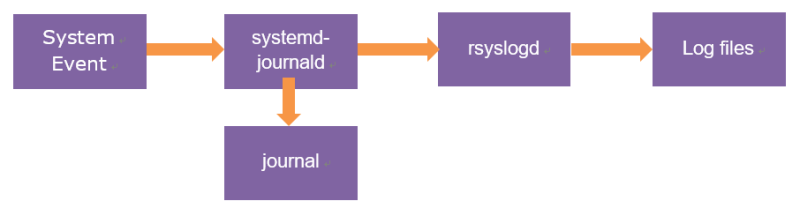
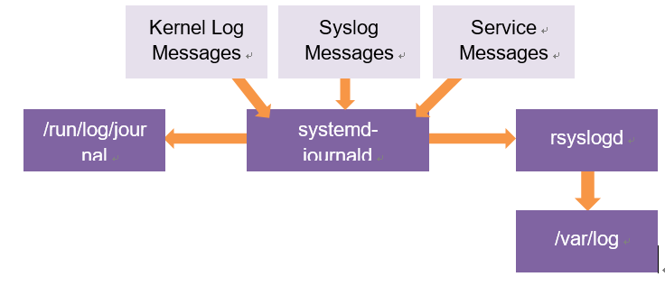

# 8.1 로그 아키텍처 (Log Architecture)
## 8.1.1 로그 관리 데몬
  > systemd 시스템에서 로그는 rsyslogd와 systemd-journald 두 데몬에 의해서 관리됨
  

  - systemd가 모든 로그를 수집하고(바이너리 형식) rsyslogd가 텍스트 파일로 저장
  - systemd는 로그를 /run/log/journal에 전달함

- /var/log의 /messages에 중요한 메시지가 저장, /secure에 보안 관련 정보가 저장

## 8.1.2 로그 파일의 순환 
> 1. 현재 로그 파일이 일정 크기에 도달 및 기간이 지나면 파일 이름을 변경
> 2. 빈 로그 파일을 원래 이름으로 생성
> 3. 새로운 로그는 새로운 파일에 기록
> 4. 오래된 로그 파일은 일정 기간이 지나면 자동으로 삭제 

```
[vagrant@user01 ~]$ cat /etc/logrotate.conf
# see "man logrotate" for details

# global options do not affect preceding include directives

# rotate log files weekly
weekly

# keep 4 weeks worth of backlogs
rotate 4

# create new (empty) log files after rotating old ones
create

# use date as a suffix of the rotated file
dateext

# uncomment this if you want your log files compressed
#compress

# packages drop log rotation information into this directory
include /etc/logrotate.d

# system-specific logs may be also be configured here.
```
- logrotate는 실시간으로 돌아가는 개념이 아니고, cron 등으로 수동으로 돌려주어야 함
```
[vagrant@user01 ~]$ sudo dd if=/dev/zero of=/var/log/testlog/testlog.log bs=512 count=10
10+0 records in
10+0 records out
5120 bytes (5.1 kB, 5.0 KiB) copied, 0.000176705 s, 29.0 MB/s

[vagrant@user01 ~]$ sudo vi /etc/logrotate.d/testlog
/var/log/testlog/testlog.log { # 3k가 넘어가면 로테이션, 최대 개수는 3개
        size=3k
        create 600 root root
        rotate 3
        nodateext   
        }             

[vagrant@user01 ~]$ sudo logrotate -s /var/lib/logrotate/logrotate.status /etc/logrotate.conf

[vagrant@user01 ~]$ ls -lh /var/log/testlog/
total 8.0K
-rw-------. 1 root root    0 Oct 28 03:15 testlog.log # 새로 생성
-rw-r--r--. 1 root root 5.0K Oct 28 03:08 testlog.log.1 # 기존 (4번째부터는 오래된 것부터 사라짐)
```

# 8.2 rsyslogd
> 유닉스나 리눅스 계열 시스템에서 로그를 기록하기 위한 표준 프로토콜인 syslog를 사용하여 로그를 저장하는 프로세스
## 8.2.1 /etc/rsyslog.conf
- 룰(Rule) 부분에는 rsyslogd에 의해 전달되는 로그의 규칙들이 정의되어 있음
- 공백을 기준으로 앞 부분은 필터(Filter), 뒷 부분을 액션(Action) 이라고 함
### 필터 (Filter)
> 로그 메시지를 분류하기 위한 기준
- 기능 및 우선순위 기반 필터, 속성 기반 필터, 표현 기반 필터로 분류됨
### 액션 (Action)
> 필터에 의하여 선택된 로그들이 처리되는 방법

# 8.3 systemd-journald
> 시스템이 부팅될 때부터 발생하는 모든 이벤트를 수집해서 구조화된 바이너리 형태의 저널 데이터로 저장
- 바이너리 형태의 파일이기 때문에 cat이나 tail 불가 => `journalctl` 명령 사용
- 저널 데이터는 `/run/log/journal`에 위치하고 있기 때문에 시스템이 재부팅되면 저널 데이터는 삭제됨
## 8.3.1 journalctl 사용
```
journalctl [option] [argument]
```
