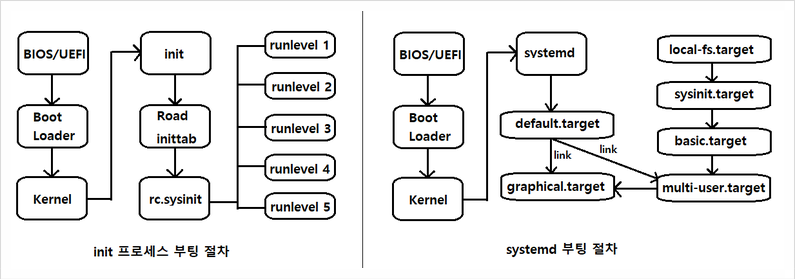
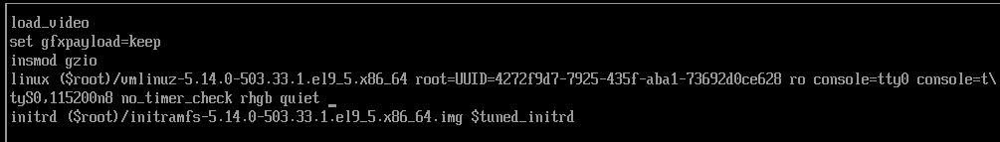

# 9.1 리눅스 시스템 부팅 절차
  
## 9.1.1 init 프로세스 부팅 절차 (RHEL7 버전 미만)
  - init은 PID 1번을 할당받음
  
### 1. BIOS / UEFI
  - 전원이 공급되면 `BIOS`나 `UEFI`가 특정 프로그램으로 하드웨어를 점검하는 `POST(Power On Self Test)`를 진행
  - 정상적으로 연결되지 않은 하드웨어가 발견되면 시스템이 부팅되지 않고, 이상이 없다면 시스템에 연결된 장치 중 부팅이 가능한 장치에서 MBR 파티션의 첫 번째 섹터인 512byte를 읽어 `부트 로더(Boot Loader)`를 찾음
  - 이후 부트 로더를 메모리에 적재한 뒤 시스템의 제어권을 부트 로더에게 전달

### 2) 부트 로더(Boot Loader)
  - 운영체제를 메모리에 적재하고, 부팅 가능한 커널의 목록을 화면에 출력하고 이미지 로드
  - 부팅하려는 커널 목록을 선택하면 `/boot` 디렉터리에 커널 파일을 메모리에 적재시키고 시스템 제어권을 커널에게 전달
  - 예시) grub

### 3) 커널 (Kernel)
  - 커널이 메모리에 적재되면 /boot 디렉터리에 존재하는 `initramfs` 압축 파일 해제 후 램 디스크 초기화를 진행하고, 루트 파일 시스템은 `/sysroot`에 임시 마운트됨
  - `initramfs` 파일은 `/sysroot`에 압축을 해제하고 필요한 파일들을 메모리에 적재시키는데, 이 때 `init` 프로세스를 사용하는 시스템은 `init` 프로세스를 실행하고, 시스템 제어권을 `init` 프로세스에게 전달함

### 4) init
  - init은 PID 1번이 할당되고 필요한 모든 프로세스를 실행
  - 그 뒤 /etc/initab 파일에 등록된 정보를 토대로 `런 레벨`이 결정되고, /etc/rc.d/rc.sysinit 파일을 실행하여 스왑이나 네트워크 설정을 초기화 함
  - 마지막으로 /etc/initab 파일에 지정된 `런 레벨`을 실행하고 사용자에게 로그인 화면을 출력함
  ```
  ls -l /usr/lib/systemd/system/runlevel0.target
  ```

## 9.2.1 systemd 부팅 절차
### systemd
  - 커널을 메모리에 적재시키는 부분까지는 init과 동일, 이후 initramfs 파일을 해제하고 systemd를 실행하여 메모리에 적재시킴
  - default.target을 활성화 하고 의존성 관계에 있는 유닛들을 모두 활성화

# 9.3 root 패스워드 복구
## 9.3.1 root 패스워드 변경
> systemd 시스템에서 root 패스워드를 복구할 때 램 디스크 초기화 단계에서 진행함
> 램 디스크 초기화 단계에선 루트 파일 시스템이 `/sysroot`에 임시로 마운트 되어 있음
> 읽기 전용(read-only)으로 마운트되어있기 때문에 읽기-쓰기(read-write)로 다시 마운트해야 함


- 부트 로더 단계에서 `위아래` 방향키를 누르다가 `e키`
- `rd.break`를 `linux`로 시작하는 라인의 마지막 줄에 추가하고 `Ctrl+X`를 입력
- 정상적으로 변경하기 위해 `console=ttySO,115200mB` 부분도 삭제해야 함

## 9.3.2 부트 로더 설정 화면
- `tty`: 리눅스는 하나의 실제 모니터와 키보드를 사용해 여러 개의 독립적인 전체 화면, 텍스트 모드를 동시에 제공
- `pts`: SSH 같은 가상 터미널(터미널 앱)
- `tts`: 여러 tty를 관리하거나 설정하는 파일

```
mount # 정보 확인
mount -o remount,rw /sysroot # ro(read-only)를 rw(read-write)로 변경

chroot /sysroot # 루트 디렉터리를 /sysroot로 변경
passwd #비밀 번호 새로 설정

touch /.autorelabel # SELinux 보안 레이블을 다시 붙이게 하는 표식 파일 생성 (다음 부팅 시 SELinux가 자동으로 파일 권한 재정비)
exit # chroot 환경에서 나옴 (initramfs 쉘로 돌아감)
exit # 복구 모드를 종료하고 재부팅 (시스템이 정상 부팅되고, 새 비밀번호로 root 로그인 가능)
```

