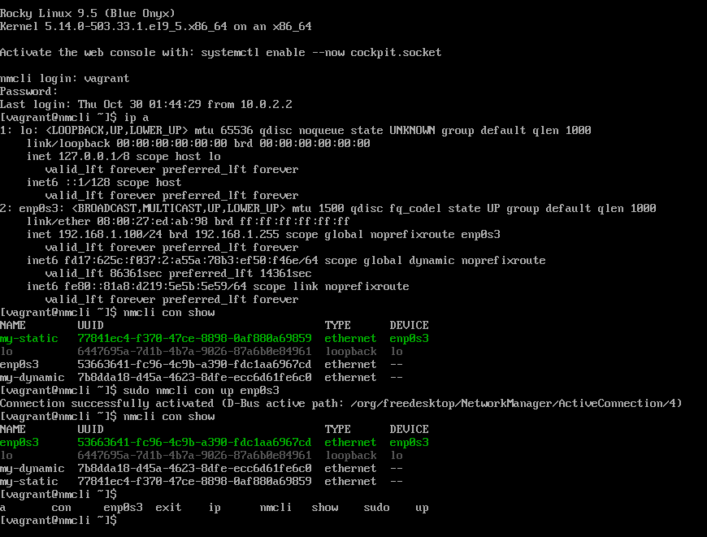
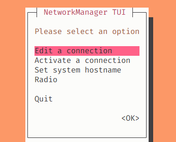

# 11.1 네트워크 정보 확인
## 11.1.1 ip 명령
- 라우팅, 장치에 대한 설정을 조정하거나 보여주는 명령
- 서브 커맨드를 입력할 때 전체를 완벽하게 입력하지 않고 겹치지 않는 일부 부분까지만 입력해도 정상으로 인식
> ip [subcommand1] [subcommand2]... [argument]

### ip a

```
[vagrant@nmcli ~]$ ip a
1: lo: <LOOPBACK,UP,LOWER_UP> mtu 65536 qdisc noqueue state UNKNOWN group default qlen 1000
    link/loopback 00:00:00:00:00:00 brd 00:00:00:00:00:00
    inet 127.0.0.1/8 scope host lo # 루프백 
       valid_lft forever preferred_lft forever
    inet6 ::1/128 scope host
       valid_lft forever preferred_lft forever
2: enp0s3: <BROADCAST,MULTICAST,UP,LOWER_UP> mtu 1500 qdisc fq_codel state UP group default qlen 1000
    link/ether 08:00:27:ed:ab:98 brd ff:ff:ff:ff:ff:ff
    inet 10.0.2.15/24 brd 10.0.2.255 scope global dynamic noprefixroute enp0s3 # NAT
       valid_lft 86299sec preferred_lft 86299sec
    inet6 fd17:625c:f037:2:a00:27ff:feed:ab98/64 scope global dynamic mngtmpaddr
       valid_lft 86301sec preferred_lft 14301sec
    inet6 fe80::a00:27ff:feed:ab98/64 scope link
       valid_lft forever preferred_lft forever
```
## 11.1.2 ifconfig
- 전통적으로 리눅스 시스템에서 네트워크 인터페이스를 구성하거나 확인하기 위한 용도로 사용한 명령
- 네트워크 인터페이스를 활성화 또는 비활성화시키거나 네트워크 설정을 변경할 수도 있음
> ifconfig [interface-name]
```
[vagrant@nmcli ~]$ ifconfig
enp0s3: flags=4163<UP,BROADCAST,RUNNING,MULTICAST>  mtu 1500
        inet 10.0.2.15  netmask 255.255.255.0  broadcast 10.0.2.255
        inet6 fe80::a00:27ff:feed:ab98  prefixlen 64  scopeid 0x20<link>
        inet6 fd17:625c:f037:2:a00:27ff:feed:ab98  prefixlen 64  scopeid 0x0<global>
        ether 08:00:27:ed:ab:98  txqueuelen 1000  (Ethernet)
        RX packets 986  bytes 114250 (111.5 KiB)
        RX errors 0  dropped 0  overruns 0  frame 0
        TX packets 784  bytes 125756 (122.8 KiB)
        TX errors 0  dropped 0 overruns 0  carrier 0  collisions 0

lo: flags=73<UP,LOOPBACK,RUNNING>  mtu 65536
        inet 127.0.0.1  netmask 255.0.0.0
        inet6 ::1  prefixlen 128  scopeid 0x10<host>
        loop  txqueuelen 1000  (Local Loopback)
        RX packets 0  bytes 0 (0.0 B)
        RX errors 0  dropped 0  overruns 0  frame 0
        TX packets 0  bytes 0 (0.0 B)
        TX errors 0  dropped 0 overruns 0  carrier 0  collisions 0
```

## 11.1.3 라우팅 테이블 확인
- 라우팅은 네트워크를 통해 데이터를 전송할 때 데이터를 보낼 경로를 선택하는 과정
- 한 시스템에 서로 다른 네트워크로 연결된 여러 개의 네트워크 인터페이스가 존재할 경우, 데이터를 전송할 때 어떤 네트워크 인터페이스로 전송할지 결정해야 함
-> 이러한 상황에서 데이터 전송의 경로를 결정하는 기준이 **라우팅 테이블**

```
[vagrant@nmcli ~]$ ip route # 라우팅 경로를 확인하기 위한 ip 명령
default via 10.0.2.2 dev enp0s3 proto dhcp src 10.0.2.15 metric 100 # 기본 경로, 게이트웨이 주소, 우선 순위 등
10.0.2.0/24 dev enp0s3 proto kernel scope link src 10.0.2.15 metric 100

[vagrant@nmcli ~]$ route
Kernel IP routing table
Destination     Gateway         Genmask         Flags Metric Ref    Use Iface
default         _gateway        0.0.0.0         UG    100    0        0 enp0s3
10.0.2.0        0.0.0.0         255.255.255.0   U     100    0        0 enp0s3
```

## 11.1.4 네트워크 연결 확인
- 네트워크를 구성한 후 네트워크가 정상적으로 연결되었는지 확인하거나, 외부 목적지로 연결 시 연결 경로를 테스트할 수 있음
- 경로 확인에 사용되는 명령은 `traceroute` 또는 `tracepath` 명령으로, 목적지에 ICMP 요청 시 IP 프로토콜의 헤더를 조작하여 목적지까지 도달하기 위한 네트워크의 중간 지점을 확인 가능

### traceroute 
- 목적지까지 가는 라우터 경로를 출력하는 명령
- 만약 네트워크가 정확하게 설정이 되어 있지 않거나 잘못된 주소를 입력하게 되면 결과가 출력되지 않을 수 있음
- root 사용자만이 사용 가능한 옵션들이 존재
> traceroute [option] destination

### tracepath
- traceroute와 같은 기능을 하는 명령으로, traceroute에 비해 결과 값을 조금 더 간결하게 출력
> tracepath [option] destination

```
tracepath 8.8.8.8
traceroute 8.8.8.8
```

# 11.2 네트워크 관리자
## 11.2.1 nmcli(Network Manager Command Line Interface)
- 네트워크 관리자가 제공하는 가장 강력한 커맨드라인 도구
```
[vagrant@nmcli ~]$ nmcli
enp0s3: connected to enp0s3
        "Red Hat Virtio"
        ethernet (virtio_net), 08:00:27:ED:AB:98, hw, mtu 1500
        ip4 default
        inet4 10.0.2.15/24
        route4 10.0.2.0/24 metric 100
        route4 default via 10.0.2.2 metric 100
        inet6 fd17:625c:f037:2:a00:27ff:feed:ab98/64
        inet6 fe80::a00:27ff:feed:ab98/64
        route6 fe80::/64 metric 256
        route6 default via fe80::2 metric 1024
        route6 fd17:625c:f037:2::/64 metric 256
```
```
[vagrant@nmcli ~]$ nmcli con show
NAME    UUID                                  TYPE      DEVICE 
enp0s3  53663641-fc96-4c9b-a390-fdc1aa6967cd  ethernet  enp0s3
lo      6447695a-7d1b-4b7a-9026-87a6b0e84961  loopback  lo

[vagrant@nmcli ~]$ nmcli connection show enp0s3
connection.id:                          enp0s3
connection.uuid:                        53663641-fc96-4c9b-a390-fdc1aa6967cd
connection.stable-id:                   --
connection.type:                        802-3-ethernet
...
```
```
[vagrant@nmcli ~]$ sudo nmcli connection add type ethernet con-name "my-dynamic" ifname enp0s3 autoconnect yes
Connection 'my-dynamic' (7b8dda18-d45a-4623-8dfe-ecc6d61fe6c0) successfully added.
[vagrant@nmcli ~]$ sudo nmcli connection add type ethernet con-name "my-static" ifname enp0s3 ipv4.method manual ipv4.addresses 192.168.1.100/24 ipv4.gateway 192.168.1.1
Connection 'my-static' (77841ec4-f370-47ce-8898-0af880a69859) successfully added.

[vagrant@nmcli ~]$ nmcli connection show
NAME        UUID                                  TYPE      DEVICE 
enp0s3      53663641-fc96-4c9b-a390-fdc1aa6967cd  ethernet  enp0s3
lo          6447695a-7d1b-4b7a-9026-87a6b0e84961  loopback  lo
my-dynamic  7b8dda18-d45a-4623-8dfe-ecc6d61fe6c0  ethernet  --
my-static   77841ec4-f370-47ce-8898-0af880a69859  ethernet  --

[vagrant@nmcli ~]$ sudo nmcli con modify my-static ipv4.dns "8.8.8.8 1.1.1.1"
```



## nmtui


# 11.4 호스트이름(hostname) 설정
- IP 주소 대신 의미 있는 단어의 형태로 주소를 입력하고, 입력한 주소를 다시 IP 주소로 변환하는 방식
- 시스템의 호스트 이름을 확인하는 기본 명령은 `hostname`
- `hostname` 명령 뒤에 인자를 입력하여 호스트 이름을 변경할 수 있지만 시스템이 재부팅되면 다시 이전의 호스트 이름으로 변경됨
```
[vagrant@nmcli ~]$ hostname
nmcli

[vagrant@nmcli ~]$ hostnamectl
 Static hostname: nmcli
       Icon name: computer-vm
         Chassis: vm 🖴
      Machine ID: aadf5d0d34da49718f3f95cc36adf5f6
         Boot ID: e44b8b671b9149fca37727a39b2607e7
  Virtualization: oracle
Operating System: Rocky Linux 9.5 (Blue Onyx)
     CPE OS Name: cpe:/o:rocky:rocky:9::baseos
          Kernel: Linux 5.14.0-503.33.1.el9_5.x86_64
    Architecture: x86-64
 Hardware Vendor: innotek GmbH
  Hardware Model: VirtualBox
Firmware Version: VirtualBox
```
## 11.4.1 호스트 이름 분류
- 호스트 이름은 `static`, `transient`, `pretty` 세 가지 방식으로 분류됨

|분류|설명|
|---|---|
|static 호스트 이름|사용자가 지정한 정적인 호스트 이름, `/etc/hostname` 파일에 저장|
|transient 호스트 이름|커널이 유지 관리하는 동적 호스트 이름, `static` 호스트 이름보다 우선 순위가 낮음, DHCP나 mDNS로 변경될 수 있음|
|pretty 호스트 이름|자유 형식의 UTF-8로 인코딩된 호스트 이름, 길이와 문자에 대한 제한이 거의 없음, 특수문자 표현 가능|

```
[vagrant@nmcli ~]$ sudo hostnamectl set-hostname "rocky9"
[vagrant@nmcli ~]$ hostname
rocky9
[vagrant@nmcli ~]$ cat /etc/hostname
rocky9

[vagrant@nmcli ~]$ sudo hostnamectl hostname nnmcli
[vagrant@nmcli ~]$ cat /etc/hostname
nnmcli
```

```
[vagrant@nmcli ~]$ cat /etc/hosts # 도메인 이름을 IP로 바꾸기 전에 가장 먼저 참고하는 주소록같은 파일
127.0.0.1   localhost localhost.localdomain localhost4 localhost4.localdomain4
::1         localhost localhost.localdomain localhost6 localhost6.localdomain6
127.0.1.1 nmcli nmcli
```

