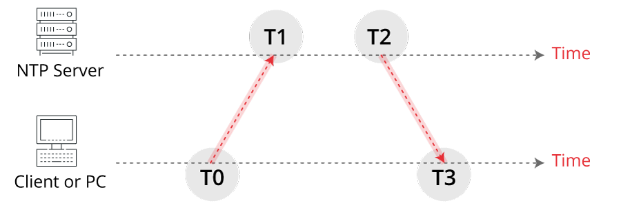
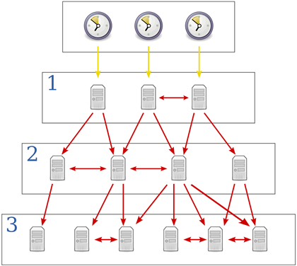

# 13.1 NTP (Network Time Protocol)
> 컴퓨터 시스템의 시간을 동기화할 때 사용하는 프로토콜

## 13.1.1 NTP 동작 방식

1. 시간 정보를 동기화시키고자 하는 클라이언트 NTP 서버로 정확한 시간 정보 요청을 전송함. 이때 자신이 가지고 있는 정확하지 않은 시간 정보를 함께 전송
2. NTP 서버는 요청을 수신 후 응답을 준비
3. NTP 서버는 요청을 전송받은 정확한 시간 정보와, 요청 수신 후 응답하는 정확한 시간 정보를 포함한 정보를 응답
=> 전송 지연 시간 오차가 발생하므로 보정을 함

## 13.1.2 NTP 계층 구조

- 1~15까지의 `단계(Stratum)`으로 구분
- 0이 가장 상위 계층으로, 원자 시계나 GPS 등 정밀한 시간 계측 장비를 의미하고, 1~15 서버는 각각 상위 계층으로부터 시간 정보를 동기화 함
=> 상위 계층일 수록 더욱 정확한 시간 정보

# 13.2 chrony
> 최신 리눅스에서는 `chrony`를 사용
- `chrony`는 서비스 데몬인 `chronyd`와 `chronyd`를 제어하기 위한 사용자 명령인 `chronyc`로 구성됨
- `chrony`는 데몬 형태로 동작하며 지속적으로 시스템의 시간을 NTP 서버와 동기화함

## 13.2.1 시간 정보 확인
```
[vagrant@user01 ~]$ sudo vi /etc/chrony.conf
[vagrant@user01 ~]$ chronyc
chrony version 4.5
Copyright (C) 1997-2003, 2007, 2009-2023 Richard P. Curnow and others
chrony comes with ABSOLUTELY NO WARRANTY.  This is free software, and
you are welcome to redistribute it under certain conditions.  See the
GNU General Public License version 2 for details.

chronyc> tracking
Reference ID    : AFD2122F (175.210.18.47)
Stratum         : 3
Ref time (UTC)  : Fri Oct 31 04:40:23 2025
System time     : 0.000000167 seconds fast of NTP time
Last offset     : -0.000165317 seconds
RMS offset      : 0.000165317 seconds
Frequency       : 0.622 ppm slow
Residual freq   : +44.360 ppm
Skew            : 0.564 ppm
Root delay      : 0.007512962 seconds
Root dispersion : 0.010229004 seconds
Update interval : 1.8 seconds
Leap status     : Normal

[vagrant@user01 ~]$ chronyc sources
MS Name/IP address         Stratum Poll Reach LastRx Last sample
===============================================================================
^? 240b:400d:3:3300:aeda:71>     0   7     0     -     +0ns[   +0ns] +/-    0ns
^? 2605:e440:44::de              0   7     0     -     +0ns[   +0ns] +/-    0ns
^- 121.174.142.82                3   6   177    18  -4355us[-4355us] +/-   54ms
^? any.time.nl                   0   7     0     -     +0ns[   +0ns] +/-    0ns
^* 175.210.18.47                 2   6   177    19   +168us[ +512us] +/-   11ms
^? 240b:400d:3:3300:aeda:71>     0   7     0     -     +0ns[   +0ns] +/-    0ns
^? 2401:c080:1c00:24a1:5400>     0   8     0     -     +0ns[   +0ns] +/-    0ns
```

- ^* : 현재 선택되어 동기화에 사용 중인 서버(Active source)
- ^+ : 후보로 선택된 서버(선호)
- ^- : 허용 가능한 후보
- ^? : 도달 불가 / 응답 없음 (unreachable)
- ^! 등 : 문제(예: falseticker) — 여기선 없음

```
[vagrant@user01 ~]$ sudo systemctl reload chronyd
Failed to reload chronyd.service: Job type reload is not applicable for unit chronyd.service.
[vagrant@user01 ~]$ sudo systemctl reload chronyd.service
Failed to reload chronyd.service: Job type reload is not applicable for unit chronyd.service.

[vagrant@user01 ~]$ sudo systemctl restart chronyd.service
[vagrant@user01 ~]$ sudo systemctl restart chronyd

sudo vi /etc/chrony.conf

# pool 2.rocky.pool.ntp.org iburst
server qwerNullNTP.ntp.server.con iburst #이렇게 변경

[vagrant@user01 ~]$ chronyc tracking
...
Leap status     : Not synchronised

server time.bora.net iburst #이렇게 변경
[vagrant@user01 ~]$ chronyc tracking
Reference ID    : CBF8F08C (time.bora.net)
Leap status     : Normal
...
```

## 13.2.2 설정 변경
### date
```
[vagrant@user01 ~]$ date
Fri Oct 31 05:03:00 AM UTC 2025
[vagrant@user01 ~]$ sudo date -s "2026-12-25 12:25:25"
Fri Dec 25 12:25:25 PM UTC 2026
[vagrant@user01 ~]$ sudo date +%Y%m%d -s "20271225"
20271225
[vagrant@user01 ~]$ date
Sat Dec 25 12:00:03 AM UTC 2027
```
### timedatectl
- 시스템의 시간 및 날짜 변경, 표준 시간대 변경, 원격지 서버와 자동 동기화 설정 등을 수행

```
[vagrant@user01 ~]$ timedatectl
               Local time: Sat 2027-12-25 00:02:26 UTC
           Universal time: Sat 2027-12-25 00:02:26 UTC
                 RTC time: Fri 2025-10-31 05:07:35
                Time zone: UTC (UTC, +0000)
System clock synchronized: no
              NTP service: active
          RTC in local TZ: yes
 
[vagrant@user01 ~]$ sudo timedatectl set-timezone Asia/Seoul # 타임존 변경
[vagrant@user01 ~]$ timedatectl
                ...
                Time zone: Asia/Seoul (KST, +0900)
                ...
 
Warning: The system is configured to read the RTC time in the local time zone.
         This mode cannot be fully supported. It will create various problems
         with time zone changes and daylight saving time adjustments. The RTC
         time is never updated, it relies on external facilities to maintain it.
         If at all possible, use RTC in UTC by calling
         'timedatectl set-local-rtc 0'.

# 서브 커맨드의 인자로 0을 입력할 경우 RTC의 시간 정보는 UTC로 설정되고, 1을 입력할 경우 RTC의 시간 정보는 시스템의 현재 시간대 정보로 설정됨
[vagrant@user01 ~]$ sudo timedatectl set-local-rtc 0 
[vagrant@user01 ~]$ sudo timedatectl set-ntp true # ntp 서버 사용 여부 결정
[vagrant@user01 ~]$ sudo systemctl restart chronyd.service
[vagrant@user01 ~]$ sudo systemctl daemon-reload 
 ```

