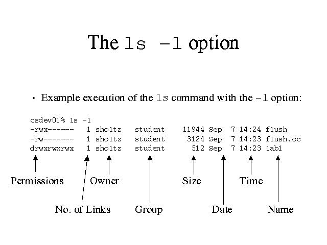

# 3.1 디렉터리 작업
## 현재 작업 디렉터리 확인
```pwd```: 현재 접근하여 작업하고 있는 디렉터리 확인
```
[vagrant@user01 ~]$ pwd
/home/vagrant
```
## 디렉터리 내용 확인
- 디렉터리가 가지고 있는 파일 또는 하위 디렉터리 확인
```ls options pathname```
```
[vagrant@user01 ~]$ ls
a       date_log.txt  dir2  dirC ...
```
## 숨겨진 파일 보기
- ls 명령어는 기본적으로 숨겨진 파일을 표시하지 않음.
- 파일 이름 가장 처음에 마침표(.)가 있으면 모두 숨겨진 파일로 인식하여, 반드시 `-a` 옵션을 사용해야 확인 가능
```
[vagrant@user01 ~]$ ls -a
.   backup         .bash_profile  date_log.txt  dirA ...
```

## 디렉터리 내용 자세히 보기
- 디렉터리의 내용의 자세한 정보를 확인하기 위해서는 `ls` 명령어의 `-l` 옵션 사용 (Long List)
```
[vagrant@user01 ~]$ ls -l
total 26900
drwxr-xr-x.   3 vagrant vagrant       16 Oct 10 19:52 a
drwxr-xr-x.   2 vagrant vagrant       19 Oct 10 20:24 backup
-rw-r--r--.   1 vagrant vagrant     3200 Oct 17 00:30 date_log.txt
...
```


- 특정 디렉터리의 내용을 자세히 확인하기 위해 디렉터리 이름을 아규먼트로 사용 가능
```
# 예시
[vagrant@user01 ~]$ ls -l dir1
total 1164
-rw-r--r--.   1 vagrant vagrant     18 Oct 10 19:35 adjtime
-rw-r--r--.   1 vagrant vagrant   1529 Oct 10 19:35 aliases
...
```
## 개별 디렉터리 확인
- 특정 디렉터리의 내용이 아니라 디렉터리 그 자체를 확인하려면 `-d` 옵션 사용
```
[vagrant@user01 ~]$ ls -ld dir1
drwxr-xr-x. 104 vagrant vagrant 8192 Oct 14 09:35 dir1
```

## 디렉터리 하위 목록 보기
- 현재 디렉터리의 내용 중 하위 디렉터리가 있는 경우 하위 디렉터리를 모두 확인하기 위해서 `-R` 옵션 사용
```
[vagrant@user01 ~]$ ls -R dir2
dir2:
recovery_file.txt
```

## 파일 종류 확인
- ```ls -F```: 각 명령어 결과와 차이점
```
[vagrant@user01 ~]$ ls -F
a/            dir1/  docs2.tar  empty_file  file2.txt    info.sh*   
... 
```
| 기호 | 파일 종류 |
|---|---|
| / | 디렉터리 파일|
| * | 실행 파일|
| (none) | 텍스트 / ASCII 파일|
| @ | 심볼릭 링크 파일|

- ```ls -l```: 명령어의 가장 첫 필드가 파일의 종류

| 기호 | 파일 종류 |
|---|---|
| d | 디렉터리 파일|
| D | 도어(Door) 파일|
| l | 심볼릭 링크 파일|
| b | 블록 장치 파일|
| c | 캐릭터 장치 파일|
| p | FIFO 또는 Named Piped 파일|
| P | 이벤트 포트 파일|
| s | AF_UNIX 주소 패밀리(소켓 통신) 파일|
| - | 일반 파일(텍스트 / ASCII / 실행 파일)|


- ```file```: 특정 파일이 어떤 종류의 파일인지 확인
```
[vagrant@user01 ~]$ file dir2
dir2: directory
```

## 디렉터리 변경
- 계층 디렉터리에서 작업 시, CLI에서 내리는 모든 명령어는 모두 현재 디렉터리에서 실행됨
- 다른 디렉터리에서 명령어를 통해 작업하려면 `cd` 명령어를 사용하여 디렉터리를 변경
```
cd directory
```
```
[vagrant@user01 ~]$ pwd
/home/vagrant
[vagrant@user01 ~]$ cd dir2
[vagrant@user01 dir2]$ pwd
/home/vagrant/dir2
```

### 경로 이름 축약
- `.`: 현재 작업 디렉터리
- `..`: 부모 디렉터리
```
[vagrant@user01 dir2]$ pwd
/home/vagrant/dir2
[vagrant@user01 dir2]$ cd ..
[vagrant@user01 ~]$ pwd
/home/vagrant
```

### 절대 경로 / 상대 경로
- 절대 경로: 이동하고자 하는 디렉터리 경로를 무조건 / 최상위 디렉터리를 기준으로 표현
- 상대 경로: 이동하고자 하는 디렉터리 경로를 현재 위치한 작업 디렉터리 기준으로 표현
> 사용자의 홈디렉터리로 이동하기 위해서는 `cd` 명령어와 함께 틸드(~) 문자를 사용
```
[vagrant@user01 ~]$ cd dir2
[vagrant@user01 dir2]$ pwd
/home/vagrant/dir2
[vagrant@user01 dir2]$ cd ~
[vagrant@user01 ~]$ pwd
/home/vagrant
```

> 현재 작업 디렉터리의 이전 디렉터리로 이동하기 위해서는 `cd` 명령어와 함께 대시(-) 문자를 사용
```
[vagrant@user01 ~]$ pwd
/home/vagrant
[vagrant@user01 ~]$ cd -
/home/vagrant/dir2
```

# 3.2 파일 작업
- 텍스트 파일, ASCII 파일과 같은 일반 문자열로 되어 있는 파일에 내용을 확인할 수 있음

## cat 명령어
- 하나 이상의 텍스트 파일을 화면으로 출력해주는 명령어
```
cat filename
```
```
[vagrant@user01 ~]$ cat hello
sadasasda

asd
d
asd
ads
```

## more 명령어
- 텍스트 파일의 내용을 확인할 수 있으나, 내용이 긴 텍스트 파일을 페이지 단위로 보여주는 명령어
```
more filename
```
```
[vagrant@user01 ~]$ more hello
sadasasda
as
das
das
--More--(38%)
```

## head 명령어
- 기본적으로 파일의 첫 10줄만을 보여주는 명령어
- `-n` 옵션은 보고싶은 줄의 수슬 지정
```
head [-n] filename
```
```
[vagrant@user01 ~]$ tail -2 hello
e

```

## tail 명령어
- 기본적으로 파일의 10줄만을 보여주는 명령어
- `-n` 옵션은 파일의 마지막 줄부터 위로 몇 번째 줄까지 읽을 지 지정하는 옵션이고, +n 옵션은 파일의 n번째 줄에서 마지막 줄까지 확인 가능
```
tail [-n] filename
tail [+n] filename
```
```
[vagrant@user01 ~]$ tail -3 hello
fdqegwhserueahers
e
```

## wc 명령어
- 파일의 줄/단어/문자수 확인
```
wc option filename
```
```
[vagrant@user01 ~]$ wc dir2
wc: dir2: Is a directory
      0       0       0 dir2
```
|옵션|설명|
|---|---|
| -l | 줄 개수 |
| -w | 단어 개수 |
| -c | 바이트(Byte) 개수 |
| -m | 문자 개수 |